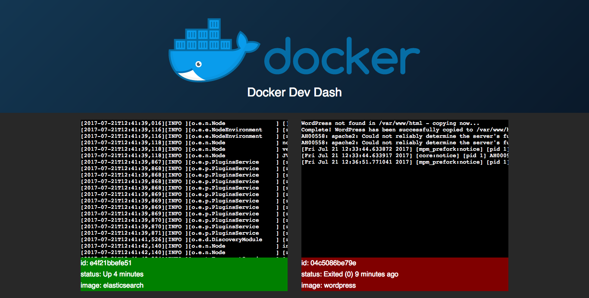

# Docker Dev Dash Instantly see docker container logs

Docker Dev Dash was developed to make make monitoring docker logs during development convenient. It aims to solve the problem of managing mutiple shell windows to see logging information comming from each container




## Getting Started

````
npm install docker-dev-dash -g
````

You can install at a project level but there's no advantage

## Running

````
docker-dev-dash
````

Open a browser an navigate to

````
http://localhost:3030
````

## Custom setup

If you need to change the port then use the -p flag

````
docker-dev-dash -p 8080
````

Open a browser an navigate to

````
http://localhost:8080
````

